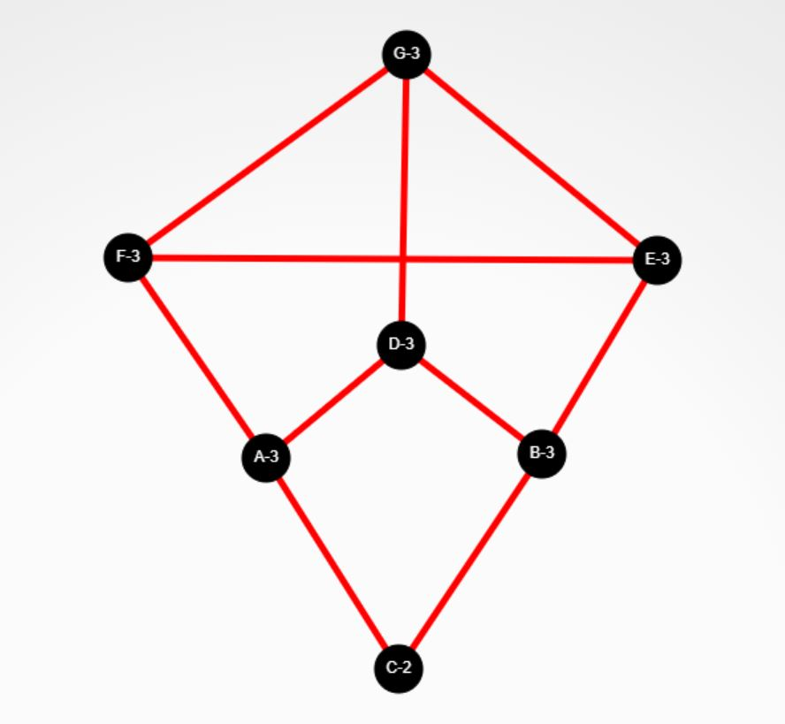
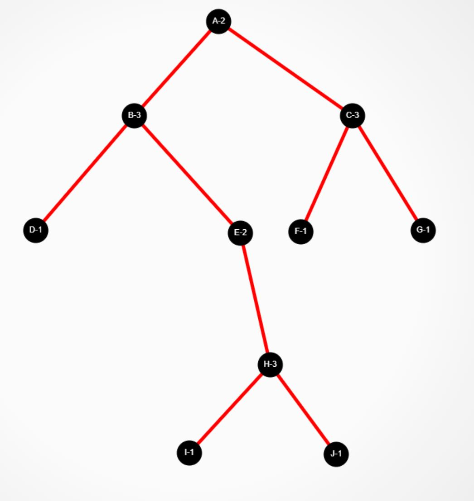

# Part 1 : turning graphs into adjacency lists and matrices (6 points)

Given the following graphs, create their adjacency matrices and adjacency lists:

If the graphs below are not visible, switch to the parent directory, go to the directory called www and find graph_1.JPG and graph_2.JPG.

## Graph 1:


## Graph 2:


## Graph 3: random directory logic

You are given a bunch of files and folders. **Draw a graph of the files and folders**, and also create a modified adjacency matrix **or** list (note that for graph three you only need to supply one of these). The modification here is that there is an additional flag for each node. If the node is a directory, add a d flag and if it is a file add and f flag

Example:

```

[...
    node: my_folder     | edges: 1,2,3  |flag: d
    node: my_file.txt   | edges:        |flag: f
...]

```
There are two nodes listed above where one is a directory and another is a file. You can assume that all files have a .ext extension blurb at the end of the file name. 

Files and directories:

```

/bin/login.sh
/bin/logout.sh
/users/ariel/life.game
/users/thedude/bowling.png
/exe/brains.load
/history/news/2-18-22.md
/assignments/assignment1.txt
/assignments/solutions.all

```

# Part 2: For the graphs above answer these questions (9 points):

### 1: Is the graph a tree? why or why not (if it is, prove why, if it isn't give a proof by contradiction)?

### 2: The chromatic number of a graph is the minimal number of colours needed to colour the vertices in such a way that no two adjacent vertices have the same colour.

What is the chromatic number of the graphs above? Is there a reason why the chromatic number might be the same or different across the different graphs (ie, if the chromatic number is the same for two of the graphs above, might there be a reason why)?

### 3: The complement or inverse of a graph G is a graph H on the same vertices such that two distinct vertices of H are adjacent if and only if they are not adjacent in G.

In other words, remove the current edges of the graph and add all nonexisting edges to the graph. If you look at an adjacency matrix, it's sort of like flipping all of the bits.

 Give an adjacency list or matrix representation of the above graphs.

## The following question is not related to the graphs above (5 points): 

### 4: 
- A: The graphs above are considered "sparse" meaning that the number of edges that exist are much fewer than the total possible number of edges. As a result, the complement of the above graphs are dense. Try to do your own research and list three real world graph applications which are dense and three real world graph applications which are sparse.

- B: Can you think of any situations (at least 2 situations) when it might make sense to store the complement of a graph or to use the complement of a graph in an algorithm? 

